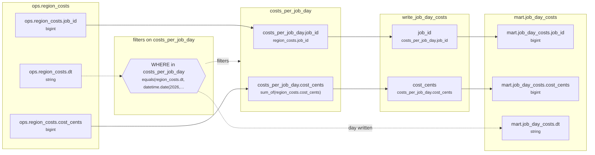

# Lineage: write_job_day_costs

Made by `export_lineage`. The chart is written in Mermaid, which JupyterLab draws. Arrows run from where a value comes from to where it goes. A solid arrow carries a value. A dotted arrow carries a column into a condition, or runs from a condition to the step whose rows it decides (labelled "filters"). A dotted arrow labelled "day written" runs from a write's date bound to the day of the Saved table it writes.

## Graph



## write_job_day_costs

It writes the Saved table mart.job_day_costs, one day at a time.

### Calculated columns

Every column that is calculated rather than copied, in the order it is calculated.

#### `costs_per_job_day.cost_cents`

Calculated in **costs_per_job_day** as `sum_of(region_costs.cost_cents)`, which is `SUM(region_costs.cost_cents)`.

```text
costs_per_job_day.cost_cents = sum_of(region_costs.cost_cents)
└─ ops.region_costs.cost_cents  (bigint)
```

Rows that count:
- WHERE in costs_per_job_day: `equals(region_costs.dt, datetime.date(2026, 9, 24))`, which is `region_costs.dt = '20260924'` (reads ops.region_costs.dt)

One value for each different `region_costs.job_id` and `region_costs.dt`.

### Copied columns

| Output | Comes from |
| --- | --- |
| `job_id` | costs_per_job_day.job_id ← ops.region_costs.job_id |
| `cost_cents` | costs_per_job_day.cost_cents (calculated) ← ops.region_costs.cost_cents |

### Hive as submitted

```sql
WITH costs_per_job_day AS (
  SELECT
    region_costs.job_id,
    region_costs.dt,
    SUM(region_costs.cost_cents) AS cost_cents
  FROM ops.region_costs AS region_costs
  WHERE
    region_costs.dt = '20260924'
  GROUP BY
    region_costs.job_id,
    region_costs.dt
)
INSERT OVERWRITE TABLE mart.job_day_costs PARTITION(dt = '2026-09-24')
SELECT
  costs_per_job_day.job_id,
  costs_per_job_day.cost_cents
FROM costs_per_job_day
```

---

Made by export_lineage on 2026-09-25 06:00, from your scripts at commit pinned, with sqlglot Composer 3.2.
