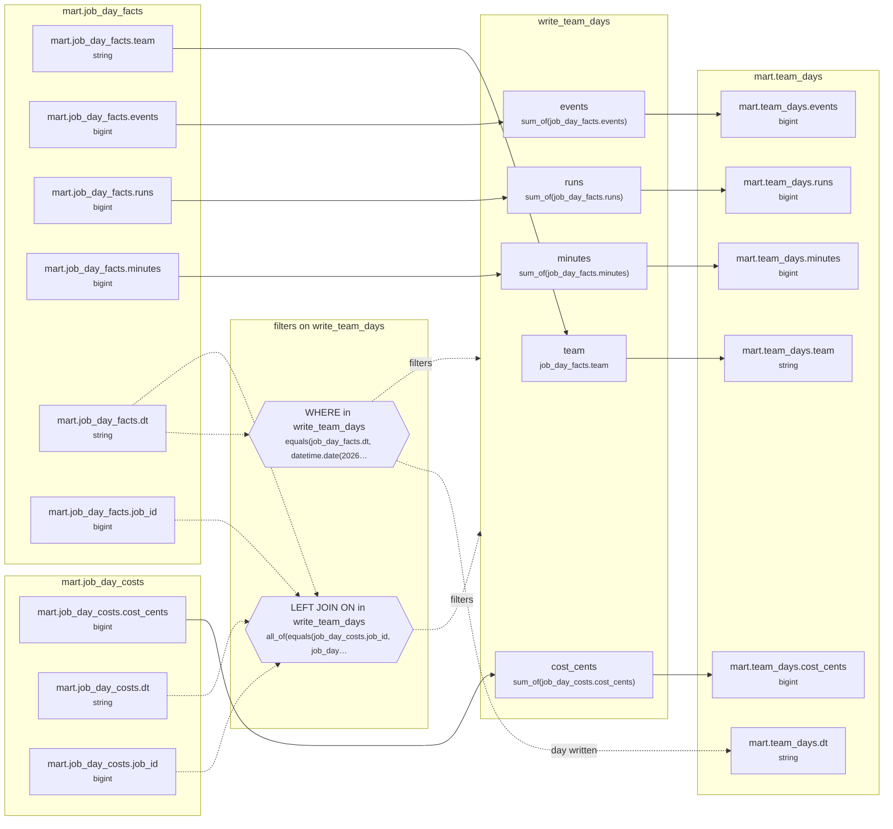

# Lineage: write_team_days

Made by `export_lineage`. The chart is written in Mermaid, which JupyterLab draws. Arrows run from where a value comes from to where it goes. A solid arrow carries a value. A dotted arrow carries a column into a condition, or runs from a condition to the step whose rows it decides (labelled "filters"). A dotted arrow labelled "day written" runs from a write's date bound to the day of the Saved table it writes.

## Graph



## write_team_days

It writes the Saved table mart.team_days, one day at a time.

### Calculated columns

Every column that is calculated rather than copied, in the order it is calculated.

#### `events`

Calculated in **write_team_days** as `sum_of(job_day_facts.events)`, which is `SUM(job_day_facts.events)`.

```text
write_team_days.events = sum_of(job_day_facts.events)
└─ mart.job_day_facts.events  (bigint)
```

Rows that count:
- WHERE in write_team_days: `equals(job_day_facts.dt, datetime.date(2026, 9, 24))`, which is `job_day_facts.dt = '2026-09-24'` (reads mart.job_day_facts.dt)

One value for each different `job_day_facts.dt` and `job_day_facts.team`.

#### `runs`

Calculated in **write_team_days** as `sum_of(job_day_facts.runs)`, which is `SUM(job_day_facts.runs)`.

```text
write_team_days.runs = sum_of(job_day_facts.runs)
└─ mart.job_day_facts.runs  (bigint)
```

Rows that count:
- WHERE in write_team_days: `equals(job_day_facts.dt, datetime.date(2026, 9, 24))`, which is `job_day_facts.dt = '2026-09-24'` (reads mart.job_day_facts.dt)

One value for each different `job_day_facts.dt` and `job_day_facts.team`.

#### `minutes`

Calculated in **write_team_days** as `sum_of(job_day_facts.minutes)`, which is `SUM(job_day_facts.minutes)`.

```text
write_team_days.minutes = sum_of(job_day_facts.minutes)
└─ mart.job_day_facts.minutes  (bigint)
```

Rows that count:
- WHERE in write_team_days: `equals(job_day_facts.dt, datetime.date(2026, 9, 24))`, which is `job_day_facts.dt = '2026-09-24'` (reads mart.job_day_facts.dt)

One value for each different `job_day_facts.dt` and `job_day_facts.team`.

#### `cost_cents`

Calculated in **write_team_days** as `sum_of(job_day_costs.cost_cents)`, which is `SUM(job_day_costs.cost_cents)`.

```text
write_team_days.cost_cents = sum_of(job_day_costs.cost_cents)
└─ mart.job_day_costs.cost_cents  (bigint)
```

Rows that count:
- WHERE in write_team_days: `equals(job_day_facts.dt, datetime.date(2026, 9, 24))`, which is `job_day_facts.dt = '2026-09-24'` (reads mart.job_day_facts.dt)
- LEFT JOIN ON in write_team_days: `all_of(equals(job_day_costs.job_id, job_day_facts.job_id), equals(job_day_costs.dt, job_day_facts.dt), between(job_day_costs.dt, "2026-09-24", "2026-09-24"))`, which is `job_day_costs.job_id = job_day_facts.job_id AND job_day_costs.dt = job_day_facts.dt AND job_day_costs.dt BETWEEN '2026-09-24' AND '2026-09-24'` (reads mart.job_day_costs.dt, mart.job_day_costs.job_id, mart.job_day_facts.dt, mart.job_day_facts.job_id)

One value for each different `job_day_facts.dt` and `job_day_facts.team`.

### Copied columns

| Output | Comes from |
| --- | --- |
| `team` | mart.job_day_facts.team |

### Hive as submitted

```sql
INSERT OVERWRITE TABLE mart.team_days PARTITION(dt = '2026-09-24')
SELECT
  job_day_facts.team,
  SUM(job_day_facts.events) AS events,
  SUM(job_day_facts.runs) AS runs,
  SUM(job_day_facts.minutes) AS minutes,
  SUM(job_day_costs.cost_cents) AS cost_cents
FROM mart.job_day_facts AS job_day_facts
LEFT JOIN mart.job_day_costs AS job_day_costs
  ON job_day_costs.job_id = job_day_facts.job_id
  AND job_day_costs.dt = job_day_facts.dt
  AND job_day_costs.dt BETWEEN '2026-09-24' AND '2026-09-24'
WHERE
  job_day_facts.dt = '2026-09-24'
GROUP BY
  job_day_facts.dt,
  job_day_facts.team
```

---

Made by export_lineage on 2026-09-25 06:00, from your scripts at commit pinned, with sqlglot Composer 3.2.
