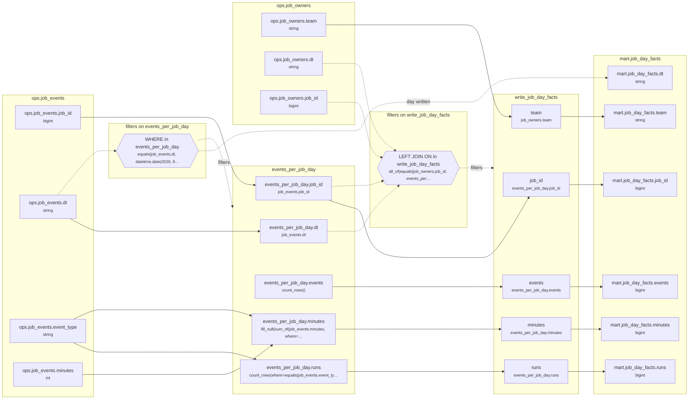

<!-- Spark Composer 4.0, exported 2026-10-06 00:26 - copy it, then edit your copy -->
# Lineage: write_job_day_facts

Made by `export_lineage`. The chart is written in Mermaid, which JupyterLab draws. Arrows run from where a value comes from to where it goes. A solid arrow carries a value. A dotted arrow carries a column into a condition, or runs from a condition to the step whose rows it decides (labelled "filters"). A dotted arrow labelled "day written" runs from a write's date bound to the day of the Saved table it writes.

## Graph



## write_job_day_facts

It writes the Saved table mart.job_day_facts, one day at a time.

### Calculated columns

Every column that is calculated rather than copied, in the order it is calculated.

#### `events_per_job_day.events`

Calculated in **events_per_job_day** as `count_rows()`, which is `COUNT(*)`.

```text
events_per_job_day.events = count_rows()
└─ (no columns: it counts rows)
```

Rows that count:
- WHERE in events_per_job_day: `equals(job_events.dt, datetime.date(2026, 9, 24))`, which is `job_events.dt = '2026-09-24'` (reads ops.job_events.dt)

One value for each different `job_events.job_id` and `job_events.dt`.

#### `events_per_job_day.runs`

Calculated in **events_per_job_day** as `count_rows(where=equals(job_events.event_type, "start"))`, which is `COUNT(CASE WHEN job_events.event_type = 'start' THEN 1 END)`.

```text
events_per_job_day.runs = count_rows(where=equals(job_events.event_type, "start"))
└─ ops.job_events.event_type  (string)
```

Rows that count:
- WHERE in events_per_job_day: `equals(job_events.dt, datetime.date(2026, 9, 24))`, which is `job_events.dt = '2026-09-24'` (reads ops.job_events.dt)

One value for each different `job_events.job_id` and `job_events.dt`.

#### `events_per_job_day.minutes`

Calculated in **events_per_job_day** as `fill_null(sum_of(job_events.minutes, where=is_in(job_events.event_type, ["finish", "fail"])), 0)`, which is `COALESCE(SUM(CASE WHEN job_events.event_type IN ('finish', 'fail') THEN job_events.minutes END), 0)`.

```text
events_per_job_day.minutes = fill_null(sum_of(job_events.minutes, where=is_in(job_events.event_type, ["finish", "fail"])), 0)
├─ ops.job_events.minutes  (int)
└─ ops.job_events.event_type  (string)
```

Rows that count:
- WHERE in events_per_job_day: `equals(job_events.dt, datetime.date(2026, 9, 24))`, which is `job_events.dt = '2026-09-24'` (reads ops.job_events.dt)

One value for each different `job_events.job_id` and `job_events.dt`.

### Copied columns

| Output | Comes from |
| --- | --- |
| `job_id` | events_per_job_day.job_id ← ops.job_events.job_id |
| `team` | ops.job_owners.team |
| `events` | events_per_job_day.events (calculated) |
| `runs` | events_per_job_day.runs (calculated) ← ops.job_events.event_type |
| `minutes` | events_per_job_day.minutes (calculated) ← ops.job_events.minutes |

### Hive as submitted

```sql
WITH events_per_job_day AS (
  SELECT
    job_events.job_id,
    job_events.dt,
    COUNT(*) AS events,
    COUNT(CASE WHEN job_events.event_type = 'start' THEN 1 END) AS runs,
    COALESCE(
      SUM(
        CASE WHEN job_events.event_type IN ('finish', 'fail') THEN job_events.minutes END
      ),
      0
    ) AS minutes
  FROM ops.job_events AS job_events
  WHERE
    job_events.dt = '2026-09-24'
  GROUP BY
    job_events.job_id,
    job_events.dt
)
INSERT OVERWRITE TABLE mart.job_day_facts PARTITION(dt = '2026-09-24')
SELECT
  events_per_job_day.job_id,
  job_owners.team,
  events_per_job_day.events,
  events_per_job_day.runs,
  events_per_job_day.minutes
FROM events_per_job_day
LEFT JOIN ops.job_owners AS job_owners
  ON job_owners.job_id = events_per_job_day.job_id
  AND job_owners.dt = events_per_job_day.dt
  AND job_owners.dt BETWEEN '2026-09-24' AND '2026-09-24'
```

---

Made by export_lineage on 2026-09-25 06:00, from your scripts at commit pinned, with Spark Composer 4.0.
