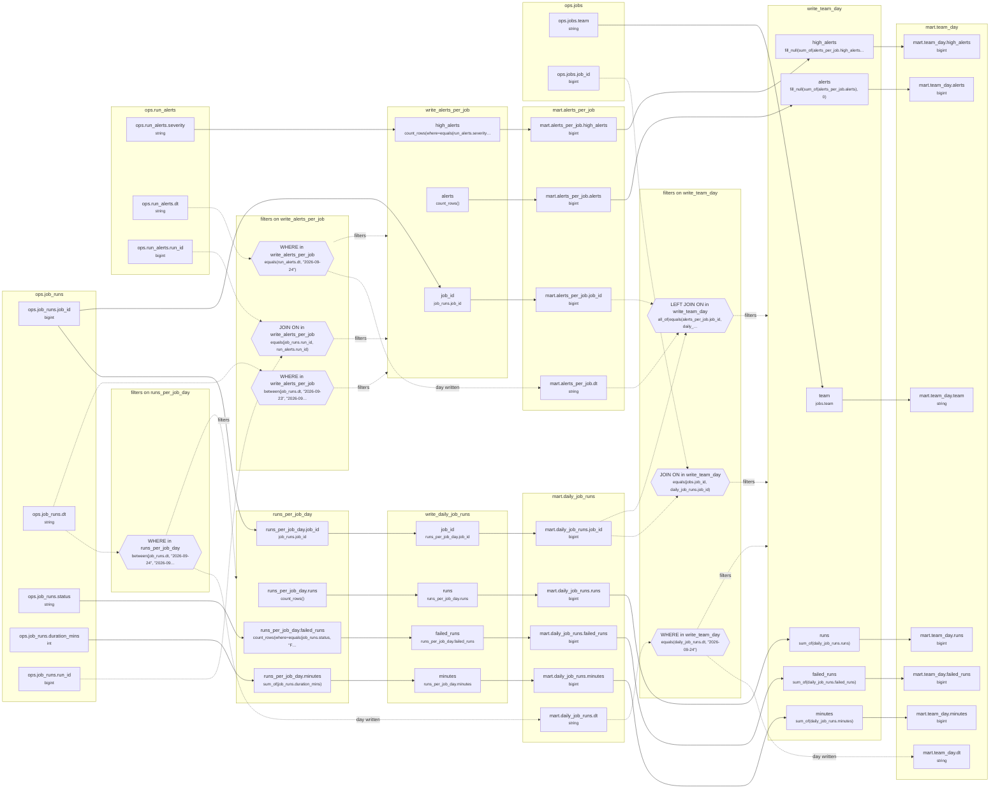

# Lineage: write_daily_job_runs, write_alerts_per_job, write_team_day

Made by `export_lineage`. The chart is written in Mermaid, which JupyterLab draws. Arrows run from where a value comes from to where it goes. A solid arrow carries a value. A dotted arrow carries a column into a condition, or runs from a condition to the step whose rows it decides (labelled "filters"). A dotted arrow labelled "day written" runs from a write's date bound to the day of the Saved table it writes.

## Graph



## write_daily_job_runs

It writes the Saved table mart.daily_job_runs, one day at a time.

### Calculated columns

Every column that is calculated rather than copied, in the order it is calculated.

#### `runs_per_job_day.runs`

Calculated in **runs_per_job_day** as `count_rows()`, which is `COUNT(*)`.

```text
runs_per_job_day.runs = count_rows()
└─ (no columns: it counts rows)
```

Rows that count:
- WHERE in runs_per_job_day: `between(job_runs.dt, "2026-09-24", "2026-09-24")`, which is `job_runs.dt BETWEEN '2026-09-24' AND '2026-09-24'` (reads ops.job_runs.dt)

One value for each different `job_runs.job_id` and `job_runs.dt`.

#### `runs_per_job_day.failed_runs`

Calculated in **runs_per_job_day** as `count_rows(where=equals(job_runs.status, "FAILED"))`, which is `COUNT(CASE WHEN job_runs.status = 'FAILED' THEN 1 END)`.

```text
runs_per_job_day.failed_runs = count_rows(where=equals(job_runs.status, "FAILED"))
└─ ops.job_runs.status  (string)
```

Rows that count:
- WHERE in runs_per_job_day: `between(job_runs.dt, "2026-09-24", "2026-09-24")`, which is `job_runs.dt BETWEEN '2026-09-24' AND '2026-09-24'` (reads ops.job_runs.dt)

One value for each different `job_runs.job_id` and `job_runs.dt`.

#### `runs_per_job_day.minutes`

Calculated in **runs_per_job_day** as `sum_of(job_runs.duration_mins)`, which is `SUM(job_runs.duration_mins)`.

```text
runs_per_job_day.minutes = sum_of(job_runs.duration_mins)
└─ ops.job_runs.duration_mins  (int)
```

Rows that count:
- WHERE in runs_per_job_day: `between(job_runs.dt, "2026-09-24", "2026-09-24")`, which is `job_runs.dt BETWEEN '2026-09-24' AND '2026-09-24'` (reads ops.job_runs.dt)

One value for each different `job_runs.job_id` and `job_runs.dt`.

### Copied columns

| Output | Comes from |
| --- | --- |
| `job_id` | runs_per_job_day.job_id ← ops.job_runs.job_id |
| `runs` | runs_per_job_day.runs (calculated) |
| `failed_runs` | runs_per_job_day.failed_runs (calculated) ← ops.job_runs.status |
| `minutes` | runs_per_job_day.minutes (calculated) ← ops.job_runs.duration_mins |

### Hive as submitted

```sql
WITH runs_per_job_day AS (
  SELECT
    job_runs.job_id,
    job_runs.dt,
    COUNT(*) AS runs,
    COUNT(CASE WHEN job_runs.status = 'FAILED' THEN 1 END) AS failed_runs,
    SUM(job_runs.duration_mins) AS minutes
  FROM ops.job_runs AS job_runs
  WHERE
    job_runs.dt BETWEEN '2026-09-24' AND '2026-09-24'
  GROUP BY
    job_runs.job_id,
    job_runs.dt
)
INSERT OVERWRITE TABLE mart.daily_job_runs PARTITION(dt = '2026-09-24')
SELECT
  runs_per_job_day.job_id,
  runs_per_job_day.runs,
  runs_per_job_day.failed_runs,
  runs_per_job_day.minutes
FROM runs_per_job_day
```

## write_alerts_per_job

It writes the Saved table mart.alerts_per_job, one day at a time.

### Calculated columns

Every column that is calculated rather than copied, in the order it is calculated.

#### `alerts`

Calculated in **write_alerts_per_job** as `count_rows()`, which is `COUNT(*)`.

```text
write_alerts_per_job.alerts = count_rows()
└─ (no columns: it counts rows)
```

Rows that count:
- WHERE in write_alerts_per_job: `equals(run_alerts.dt, "2026-09-24")`, which is `run_alerts.dt = '2026-09-24'` (reads ops.run_alerts.dt)
- WHERE in write_alerts_per_job: `between(job_runs.dt, "2026-09-23", "2026-09-24")`, which is `job_runs.dt BETWEEN '2026-09-23' AND '2026-09-24'` (reads ops.job_runs.dt)
- JOIN ON in write_alerts_per_job: `equals(job_runs.run_id, run_alerts.run_id)`, which is `job_runs.run_id = run_alerts.run_id` (reads ops.job_runs.run_id, ops.run_alerts.run_id)

One value for each different `job_runs.job_id`.

#### `high_alerts`

Calculated in **write_alerts_per_job** as `count_rows(where=equals(run_alerts.severity, "high"))`, which is `COUNT(CASE WHEN run_alerts.severity = 'high' THEN 1 END)`.

```text
write_alerts_per_job.high_alerts = count_rows(where=equals(run_alerts.severity, "high"))
└─ ops.run_alerts.severity  (string)
```

Rows that count:
- WHERE in write_alerts_per_job: `equals(run_alerts.dt, "2026-09-24")`, which is `run_alerts.dt = '2026-09-24'` (reads ops.run_alerts.dt)
- WHERE in write_alerts_per_job: `between(job_runs.dt, "2026-09-23", "2026-09-24")`, which is `job_runs.dt BETWEEN '2026-09-23' AND '2026-09-24'` (reads ops.job_runs.dt)
- JOIN ON in write_alerts_per_job: `equals(job_runs.run_id, run_alerts.run_id)`, which is `job_runs.run_id = run_alerts.run_id` (reads ops.job_runs.run_id, ops.run_alerts.run_id)

One value for each different `job_runs.job_id`.

### Copied columns

| Output | Comes from |
| --- | --- |
| `job_id` | ops.job_runs.job_id |

### Hive as submitted

```sql
INSERT OVERWRITE TABLE mart.alerts_per_job PARTITION(dt = '2026-09-24')
SELECT
  job_runs.job_id,
  COUNT(*) AS alerts,
  COUNT(CASE WHEN run_alerts.severity = 'high' THEN 1 END) AS high_alerts
FROM ops.run_alerts AS run_alerts
JOIN ops.job_runs AS job_runs
  ON job_runs.run_id = run_alerts.run_id
WHERE
  run_alerts.dt = '2026-09-24'
  AND job_runs.dt BETWEEN '2026-09-23' AND '2026-09-24'
GROUP BY
  job_runs.job_id
```

## write_team_day

It reads the Saved table mart.alerts_per_job, written by write_alerts_per_job above. It reads the Saved table mart.daily_job_runs, written by write_daily_job_runs above. It writes the Saved table mart.team_day, one day at a time.

### Calculated columns

Every column that is calculated rather than copied, in the order it is calculated.

#### `runs`

Calculated in **write_team_day** as `sum_of(daily_job_runs.runs)`, which is `SUM(daily_job_runs.runs)`.

```text
write_team_day.runs = sum_of(daily_job_runs.runs)
└─ mart.daily_job_runs.runs  (bigint)
   └─ write_daily_job_runs.runs
      └─ runs_per_job_day.runs = count_rows()
```

Rows that count:
- WHERE in write_team_day: `equals(daily_job_runs.dt, "2026-09-24")`, which is `daily_job_runs.dt = '2026-09-24'` (reads mart.daily_job_runs.dt)
- JOIN ON in write_team_day: `equals(jobs.job_id, daily_job_runs.job_id)`, which is `jobs.job_id = daily_job_runs.job_id` (reads mart.daily_job_runs.job_id, ops.jobs.job_id)
- LEFT JOIN ON in write_team_day: `all_of(equals(alerts_per_job.job_id, daily_job_runs.job_id), equals(alerts_per_job.dt, "2026-09-24"))`, which is `alerts_per_job.job_id = daily_job_runs.job_id AND alerts_per_job.dt = '2026-09-24'` (reads mart.alerts_per_job.dt, mart.alerts_per_job.job_id, mart.daily_job_runs.job_id)

One value for each different `jobs.team`.

#### `failed_runs`

Calculated in **write_team_day** as `sum_of(daily_job_runs.failed_runs)`, which is `SUM(daily_job_runs.failed_runs)`.

```text
write_team_day.failed_runs = sum_of(daily_job_runs.failed_runs)
└─ mart.daily_job_runs.failed_runs  (bigint)
   └─ write_daily_job_runs.failed_runs
      └─ runs_per_job_day.failed_runs = count_rows(where=equals(job_runs.status, "FAILED"))
         └─ ops.job_runs.status  (string)
```

Rows that count:
- WHERE in write_team_day: `equals(daily_job_runs.dt, "2026-09-24")`, which is `daily_job_runs.dt = '2026-09-24'` (reads mart.daily_job_runs.dt)
- JOIN ON in write_team_day: `equals(jobs.job_id, daily_job_runs.job_id)`, which is `jobs.job_id = daily_job_runs.job_id` (reads mart.daily_job_runs.job_id, ops.jobs.job_id)
- LEFT JOIN ON in write_team_day: `all_of(equals(alerts_per_job.job_id, daily_job_runs.job_id), equals(alerts_per_job.dt, "2026-09-24"))`, which is `alerts_per_job.job_id = daily_job_runs.job_id AND alerts_per_job.dt = '2026-09-24'` (reads mart.alerts_per_job.dt, mart.alerts_per_job.job_id, mart.daily_job_runs.job_id)

One value for each different `jobs.team`.

#### `minutes`

Calculated in **write_team_day** as `sum_of(daily_job_runs.minutes)`, which is `SUM(daily_job_runs.minutes)`.

```text
write_team_day.minutes = sum_of(daily_job_runs.minutes)
└─ mart.daily_job_runs.minutes  (bigint)
   └─ write_daily_job_runs.minutes
      └─ runs_per_job_day.minutes = sum_of(job_runs.duration_mins)
         └─ ops.job_runs.duration_mins  (int)
```

Rows that count:
- WHERE in write_team_day: `equals(daily_job_runs.dt, "2026-09-24")`, which is `daily_job_runs.dt = '2026-09-24'` (reads mart.daily_job_runs.dt)
- JOIN ON in write_team_day: `equals(jobs.job_id, daily_job_runs.job_id)`, which is `jobs.job_id = daily_job_runs.job_id` (reads mart.daily_job_runs.job_id, ops.jobs.job_id)
- LEFT JOIN ON in write_team_day: `all_of(equals(alerts_per_job.job_id, daily_job_runs.job_id), equals(alerts_per_job.dt, "2026-09-24"))`, which is `alerts_per_job.job_id = daily_job_runs.job_id AND alerts_per_job.dt = '2026-09-24'` (reads mart.alerts_per_job.dt, mart.alerts_per_job.job_id, mart.daily_job_runs.job_id)

One value for each different `jobs.team`.

#### `alerts`

Calculated in **write_team_day** as `fill_null(sum_of(alerts_per_job.alerts), 0)`, which is `COALESCE(SUM(alerts_per_job.alerts), 0)`.

```text
write_team_day.alerts = fill_null(sum_of(alerts_per_job.alerts), 0)
└─ mart.alerts_per_job.alerts  (bigint)
   └─ write_alerts_per_job.alerts = count_rows()
```

Rows that count:
- WHERE in write_alerts_per_job: `between(job_runs.dt, "2026-09-23", "2026-09-24")`, which is `job_runs.dt BETWEEN '2026-09-23' AND '2026-09-24'` (reads ops.job_runs.dt)
- JOIN ON in write_alerts_per_job: `equals(job_runs.run_id, run_alerts.run_id)`, which is `job_runs.run_id = run_alerts.run_id` (reads ops.job_runs.run_id, ops.run_alerts.run_id)
- WHERE in write_team_day: `equals(daily_job_runs.dt, "2026-09-24")`, which is `daily_job_runs.dt = '2026-09-24'` (reads mart.daily_job_runs.dt)
- JOIN ON in write_team_day: `equals(jobs.job_id, daily_job_runs.job_id)`, which is `jobs.job_id = daily_job_runs.job_id` (reads mart.daily_job_runs.job_id, ops.jobs.job_id)
- LEFT JOIN ON in write_team_day: `all_of(equals(alerts_per_job.job_id, daily_job_runs.job_id), equals(alerts_per_job.dt, "2026-09-24"))`, which is `alerts_per_job.job_id = daily_job_runs.job_id AND alerts_per_job.dt = '2026-09-24'` (reads mart.alerts_per_job.dt, mart.alerts_per_job.job_id, mart.daily_job_runs.job_id)

One value for each different `jobs.team`.

#### `high_alerts`

Calculated in **write_team_day** as `fill_null(sum_of(alerts_per_job.high_alerts), 0)`, which is `COALESCE(SUM(alerts_per_job.high_alerts), 0)`.

```text
write_team_day.high_alerts = fill_null(sum_of(alerts_per_job.high_alerts), 0)
└─ mart.alerts_per_job.high_alerts  (bigint)
   └─ write_alerts_per_job.high_alerts = count_rows(where=equals(run_alerts.severity, "high"))
      └─ ops.run_alerts.severity  (string)
```

Rows that count:
- WHERE in write_alerts_per_job: `between(job_runs.dt, "2026-09-23", "2026-09-24")`, which is `job_runs.dt BETWEEN '2026-09-23' AND '2026-09-24'` (reads ops.job_runs.dt)
- JOIN ON in write_alerts_per_job: `equals(job_runs.run_id, run_alerts.run_id)`, which is `job_runs.run_id = run_alerts.run_id` (reads ops.job_runs.run_id, ops.run_alerts.run_id)
- WHERE in write_team_day: `equals(daily_job_runs.dt, "2026-09-24")`, which is `daily_job_runs.dt = '2026-09-24'` (reads mart.daily_job_runs.dt)
- JOIN ON in write_team_day: `equals(jobs.job_id, daily_job_runs.job_id)`, which is `jobs.job_id = daily_job_runs.job_id` (reads mart.daily_job_runs.job_id, ops.jobs.job_id)
- LEFT JOIN ON in write_team_day: `all_of(equals(alerts_per_job.job_id, daily_job_runs.job_id), equals(alerts_per_job.dt, "2026-09-24"))`, which is `alerts_per_job.job_id = daily_job_runs.job_id AND alerts_per_job.dt = '2026-09-24'` (reads mart.alerts_per_job.dt, mart.alerts_per_job.job_id, mart.daily_job_runs.job_id)

One value for each different `jobs.team`.

### Copied columns

| Output | Comes from |
| --- | --- |
| `team` | ops.jobs.team |

### Hive as submitted

```sql
INSERT OVERWRITE TABLE mart.team_day PARTITION(dt = '2026-09-24')
SELECT
  jobs.team,
  SUM(daily_job_runs.runs) AS runs,
  SUM(daily_job_runs.failed_runs) AS failed_runs,
  SUM(daily_job_runs.minutes) AS minutes,
  COALESCE(SUM(alerts_per_job.alerts), 0) AS alerts,
  COALESCE(SUM(alerts_per_job.high_alerts), 0) AS high_alerts
FROM mart.daily_job_runs AS daily_job_runs
JOIN ops.jobs AS jobs
  ON jobs.job_id = daily_job_runs.job_id
LEFT JOIN mart.alerts_per_job AS alerts_per_job
  ON alerts_per_job.job_id = daily_job_runs.job_id
  AND alerts_per_job.dt = '2026-09-24'
WHERE
  daily_job_runs.dt = '2026-09-24'
GROUP BY
  jobs.team
```

---

Made by export_lineage on 2026-09-25 06:00, from your scripts at commit pinned, with sqlglot Composer 3.2.
