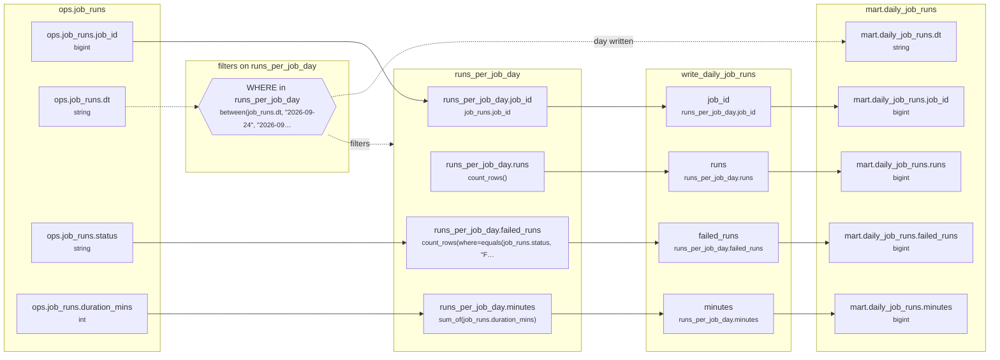

# Lineage: write_daily_job_runs

Made by `export_lineage`. The chart is written in Mermaid, which JupyterLab draws. Arrows run from where a value comes from to where it goes. A solid arrow carries a value. A dotted arrow carries a column into a condition, or runs from a condition to the step whose rows it decides (labelled "filters"). A dotted arrow labelled "day written" runs from a write's date bound to the day of the Saved table it writes.

## Graph



## write_daily_job_runs

It writes the Saved table mart.daily_job_runs, one day at a time.

### Calculated columns

Every column that is calculated rather than copied, in the order it is calculated.

#### `runs_per_job_day.runs`

Calculated in **runs_per_job_day** as `count_rows()`, which is `COUNT(*)`.

```text
runs_per_job_day.runs = count_rows()
└─ (no columns: it counts rows)
```

Rows that count:
- WHERE in runs_per_job_day: `between(job_runs.dt, "2026-09-24", "2026-09-24")`, which is `job_runs.dt BETWEEN '2026-09-24' AND '2026-09-24'` (reads ops.job_runs.dt)

One value for each different `job_runs.job_id` and `job_runs.dt`.

#### `runs_per_job_day.failed_runs`

Calculated in **runs_per_job_day** as `count_rows(where=equals(job_runs.status, "FAILED"))`, which is `COUNT(CASE WHEN job_runs.status = 'FAILED' THEN 1 END)`.

```text
runs_per_job_day.failed_runs = count_rows(where=equals(job_runs.status, "FAILED"))
└─ ops.job_runs.status  (string)
```

Rows that count:
- WHERE in runs_per_job_day: `between(job_runs.dt, "2026-09-24", "2026-09-24")`, which is `job_runs.dt BETWEEN '2026-09-24' AND '2026-09-24'` (reads ops.job_runs.dt)

One value for each different `job_runs.job_id` and `job_runs.dt`.

#### `runs_per_job_day.minutes`

Calculated in **runs_per_job_day** as `sum_of(job_runs.duration_mins)`, which is `SUM(job_runs.duration_mins)`.

```text
runs_per_job_day.minutes = sum_of(job_runs.duration_mins)
└─ ops.job_runs.duration_mins  (int)
```

Rows that count:
- WHERE in runs_per_job_day: `between(job_runs.dt, "2026-09-24", "2026-09-24")`, which is `job_runs.dt BETWEEN '2026-09-24' AND '2026-09-24'` (reads ops.job_runs.dt)

One value for each different `job_runs.job_id` and `job_runs.dt`.

### Copied columns

| Output | Comes from |
| --- | --- |
| `job_id` | runs_per_job_day.job_id ← ops.job_runs.job_id |
| `runs` | runs_per_job_day.runs (calculated) |
| `failed_runs` | runs_per_job_day.failed_runs (calculated) ← ops.job_runs.status |
| `minutes` | runs_per_job_day.minutes (calculated) ← ops.job_runs.duration_mins |

### Hive as submitted

```sql
WITH runs_per_job_day AS (
  SELECT
    job_runs.job_id,
    job_runs.dt,
    COUNT(*) AS runs,
    COUNT(CASE WHEN job_runs.status = 'FAILED' THEN 1 END) AS failed_runs,
    SUM(job_runs.duration_mins) AS minutes
  FROM ops.job_runs AS job_runs
  WHERE
    job_runs.dt BETWEEN '2026-09-24' AND '2026-09-24'
  GROUP BY
    job_runs.job_id,
    job_runs.dt
)
INSERT OVERWRITE TABLE mart.daily_job_runs PARTITION(dt = '2026-09-24')
SELECT
  runs_per_job_day.job_id,
  runs_per_job_day.runs,
  runs_per_job_day.failed_runs,
  runs_per_job_day.minutes
FROM runs_per_job_day
```

---

Made by export_lineage on 2026-09-25 06:00, from your scripts at commit pinned, with sqlglot Composer 4.1.
