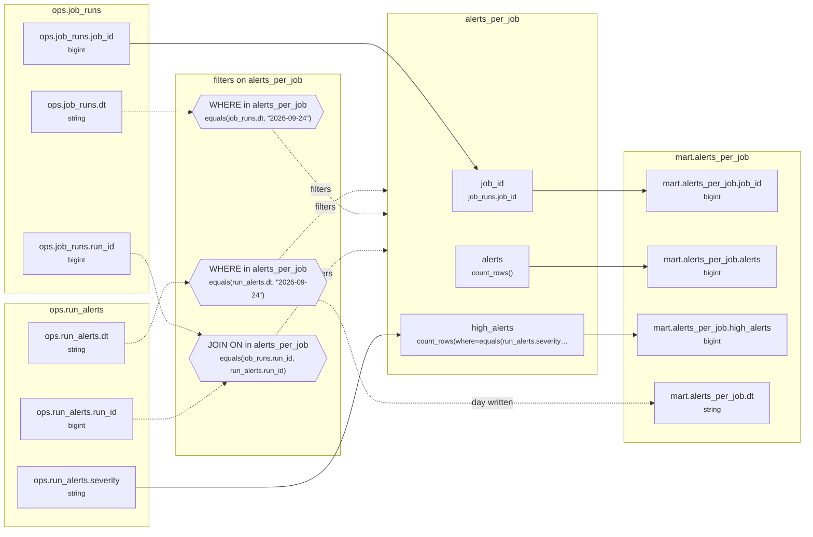

# Lineage: alerts_per_job

Made by `export_lineage`. The chart is written in Mermaid, which JupyterLab draws. Arrows run from where a value comes from to where it goes. A solid arrow carries a value. A dotted arrow carries a column into a condition, or runs from a condition to the step whose rows it decides (labelled "filters"). A dotted arrow labelled "day written" runs from a write's date bound to the day of the Saved table it writes.

## Graph



## alerts_per_job

It writes the Saved table mart.alerts_per_job, one day at a time.

### Calculated columns

Every column that is calculated rather than copied, in the order it is calculated.

#### `alerts`

Calculated in **alerts_per_job** as `count_rows()`, which is `COUNT(*)`.

```text
alerts_per_job.alerts = count_rows()
└─ (no columns: it counts rows)
```

Rows that count:
- WHERE in alerts_per_job: `equals(run_alerts.dt, "2026-09-24")`, which is `run_alerts.dt = '2026-09-24'` (reads ops.run_alerts.dt)
- WHERE in alerts_per_job: `equals(job_runs.dt, "2026-09-24")`, which is `job_runs.dt = '2026-09-24'` (reads ops.job_runs.dt)
- JOIN ON in alerts_per_job: `equals(job_runs.run_id, run_alerts.run_id)`, which is `job_runs.run_id = run_alerts.run_id` (reads ops.job_runs.run_id, ops.run_alerts.run_id)

One value for each different `job_runs.job_id`.

#### `high_alerts`

Calculated in **alerts_per_job** as `count_rows(where=equals(run_alerts.severity, "high"))`, which is `COUNT(CASE WHEN run_alerts.severity = 'high' THEN 1 END)`.

```text
alerts_per_job.high_alerts = count_rows(where=equals(run_alerts.severity, "high"))
└─ ops.run_alerts.severity  (string)
```

Rows that count:
- WHERE in alerts_per_job: `equals(run_alerts.dt, "2026-09-24")`, which is `run_alerts.dt = '2026-09-24'` (reads ops.run_alerts.dt)
- WHERE in alerts_per_job: `equals(job_runs.dt, "2026-09-24")`, which is `job_runs.dt = '2026-09-24'` (reads ops.job_runs.dt)
- JOIN ON in alerts_per_job: `equals(job_runs.run_id, run_alerts.run_id)`, which is `job_runs.run_id = run_alerts.run_id` (reads ops.job_runs.run_id, ops.run_alerts.run_id)

One value for each different `job_runs.job_id`.

### Copied columns

| Output | Comes from |
| --- | --- |
| `job_id` | ops.job_runs.job_id |

### Hive as submitted

```sql
INSERT OVERWRITE TABLE mart.alerts_per_job PARTITION(dt = '2026-09-24')
SELECT
  job_runs.job_id,
  COUNT(*) AS alerts,
  COUNT(CASE WHEN run_alerts.severity = 'high' THEN 1 END) AS high_alerts
FROM ops.run_alerts AS run_alerts
JOIN ops.job_runs AS job_runs
  ON job_runs.run_id = run_alerts.run_id
WHERE
  run_alerts.dt = '2026-09-24' AND job_runs.dt = '2026-09-24'
GROUP BY
  job_runs.job_id
```

---

Made by export_lineage on 2026-09-25 06:00, from your scripts at commit example, with sqlglot Composer 3.2.
