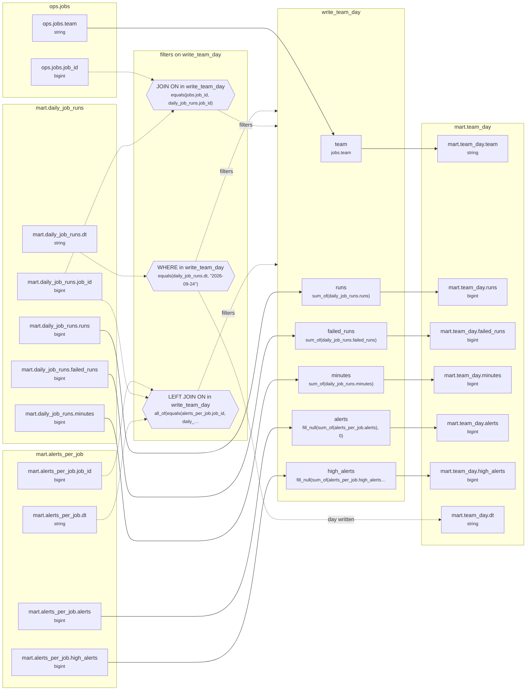

# Lineage: write_team_day

Made by `export_lineage`. The chart is written in Mermaid, which JupyterLab draws. Arrows run from where a value comes from to where it goes. A solid arrow carries a value. A dotted arrow carries a column into a condition, or runs from a condition to the step whose rows it decides (labelled "filters"). A dotted arrow labelled "day written" runs from a write's date bound to the day of the Saved table it writes.

## Graph



## write_team_day

It writes the Saved table mart.team_day, one day at a time.

### Calculated columns

Every column that is calculated rather than copied, in the order it is calculated.

#### `runs`

Calculated in **write_team_day** as `sum_of(daily_job_runs.runs)`, which is `SUM(daily_job_runs.runs)`.

```text
write_team_day.runs = sum_of(daily_job_runs.runs)
└─ mart.daily_job_runs.runs  (bigint)
```

Rows that count:
- WHERE in write_team_day: `equals(daily_job_runs.dt, "2026-09-24")`, which is `daily_job_runs.dt = '2026-09-24'` (reads mart.daily_job_runs.dt)
- JOIN ON in write_team_day: `equals(jobs.job_id, daily_job_runs.job_id)`, which is `jobs.job_id = daily_job_runs.job_id` (reads mart.daily_job_runs.job_id, ops.jobs.job_id)

One value for each different `jobs.team`.

#### `failed_runs`

Calculated in **write_team_day** as `sum_of(daily_job_runs.failed_runs)`, which is `SUM(daily_job_runs.failed_runs)`.

```text
write_team_day.failed_runs = sum_of(daily_job_runs.failed_runs)
└─ mart.daily_job_runs.failed_runs  (bigint)
```

Rows that count:
- WHERE in write_team_day: `equals(daily_job_runs.dt, "2026-09-24")`, which is `daily_job_runs.dt = '2026-09-24'` (reads mart.daily_job_runs.dt)
- JOIN ON in write_team_day: `equals(jobs.job_id, daily_job_runs.job_id)`, which is `jobs.job_id = daily_job_runs.job_id` (reads mart.daily_job_runs.job_id, ops.jobs.job_id)

One value for each different `jobs.team`.

#### `minutes`

Calculated in **write_team_day** as `sum_of(daily_job_runs.minutes)`, which is `SUM(daily_job_runs.minutes)`.

```text
write_team_day.minutes = sum_of(daily_job_runs.minutes)
└─ mart.daily_job_runs.minutes  (bigint)
```

Rows that count:
- WHERE in write_team_day: `equals(daily_job_runs.dt, "2026-09-24")`, which is `daily_job_runs.dt = '2026-09-24'` (reads mart.daily_job_runs.dt)
- JOIN ON in write_team_day: `equals(jobs.job_id, daily_job_runs.job_id)`, which is `jobs.job_id = daily_job_runs.job_id` (reads mart.daily_job_runs.job_id, ops.jobs.job_id)

One value for each different `jobs.team`.

#### `alerts`

Calculated in **write_team_day** as `fill_null(sum_of(alerts_per_job.alerts), 0)`, which is `COALESCE(SUM(alerts_per_job.alerts), 0)`.

```text
write_team_day.alerts = fill_null(sum_of(alerts_per_job.alerts), 0)
└─ mart.alerts_per_job.alerts  (bigint)
```

Rows that count:
- WHERE in write_team_day: `equals(daily_job_runs.dt, "2026-09-24")`, which is `daily_job_runs.dt = '2026-09-24'` (reads mart.daily_job_runs.dt)
- JOIN ON in write_team_day: `equals(jobs.job_id, daily_job_runs.job_id)`, which is `jobs.job_id = daily_job_runs.job_id` (reads mart.daily_job_runs.job_id, ops.jobs.job_id)
- LEFT JOIN ON in write_team_day: `all_of(equals(alerts_per_job.job_id, daily_job_runs.job_id), equals(alerts_per_job.dt, "2026-09-24"))`, which is `alerts_per_job.job_id = daily_job_runs.job_id AND alerts_per_job.dt = '2026-09-24'` (reads mart.alerts_per_job.dt, mart.alerts_per_job.job_id, mart.daily_job_runs.job_id)

One value for each different `jobs.team`.

#### `high_alerts`

Calculated in **write_team_day** as `fill_null(sum_of(alerts_per_job.high_alerts), 0)`, which is `COALESCE(SUM(alerts_per_job.high_alerts), 0)`.

```text
write_team_day.high_alerts = fill_null(sum_of(alerts_per_job.high_alerts), 0)
└─ mart.alerts_per_job.high_alerts  (bigint)
```

Rows that count:
- WHERE in write_team_day: `equals(daily_job_runs.dt, "2026-09-24")`, which is `daily_job_runs.dt = '2026-09-24'` (reads mart.daily_job_runs.dt)
- JOIN ON in write_team_day: `equals(jobs.job_id, daily_job_runs.job_id)`, which is `jobs.job_id = daily_job_runs.job_id` (reads mart.daily_job_runs.job_id, ops.jobs.job_id)
- LEFT JOIN ON in write_team_day: `all_of(equals(alerts_per_job.job_id, daily_job_runs.job_id), equals(alerts_per_job.dt, "2026-09-24"))`, which is `alerts_per_job.job_id = daily_job_runs.job_id AND alerts_per_job.dt = '2026-09-24'` (reads mart.alerts_per_job.dt, mart.alerts_per_job.job_id, mart.daily_job_runs.job_id)

One value for each different `jobs.team`.

### Copied columns

| Output | Comes from |
| --- | --- |
| `team` | ops.jobs.team |

### Hive as submitted

```sql
INSERT OVERWRITE TABLE mart.team_day PARTITION(dt = '2026-09-24')
SELECT
  jobs.team,
  SUM(daily_job_runs.runs) AS runs,
  SUM(daily_job_runs.failed_runs) AS failed_runs,
  SUM(daily_job_runs.minutes) AS minutes,
  COALESCE(SUM(alerts_per_job.alerts), 0) AS alerts,
  COALESCE(SUM(alerts_per_job.high_alerts), 0) AS high_alerts
FROM mart.daily_job_runs AS daily_job_runs
JOIN ops.jobs AS jobs
  ON jobs.job_id = daily_job_runs.job_id
LEFT JOIN mart.alerts_per_job AS alerts_per_job
  ON alerts_per_job.job_id = daily_job_runs.job_id
  AND alerts_per_job.dt = '2026-09-24'
WHERE
  daily_job_runs.dt = '2026-09-24'
GROUP BY
  jobs.team
```

---

Made by export_lineage on 2026-09-25 06:00, from your scripts at commit pinned, with sqlglot Composer 3.2.
